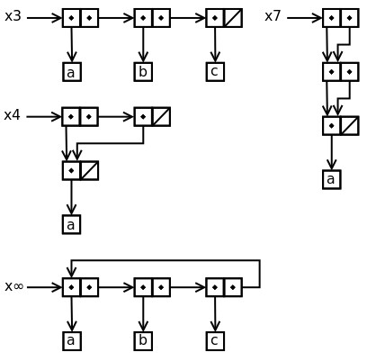

* 3为一般能想到的结果  
```scheme
(define test1 (cons a (cons b (cons '()))))
```

* 无返回值可以是无线循环用3.13中的```make-cycle```函数
```scheme
(define test2 (make-cycle (cons a (cons b (cons c '())))))
```  
* 返回4参加图
```scheme
(define test3-1 (list 'b 'c))
(define test3-2 (list 'a))
(set-car! test3-1 test3-2)
```  

* 返回7参见图
```scheme
(define test4-1 (list 'a))
(define test4-2 (list 'b))
(define test4-3 (list 'c))
(set-cdr! test4-1 test4-2)
(set-cdr! test4-2 test4-3)
```    

<div align=center></div>  

---  
#### Reference:  
> 1. [Exercise 3.16](https://wizardbook.wordpress.com/2010/12/15/exercise-3-15-2/)
